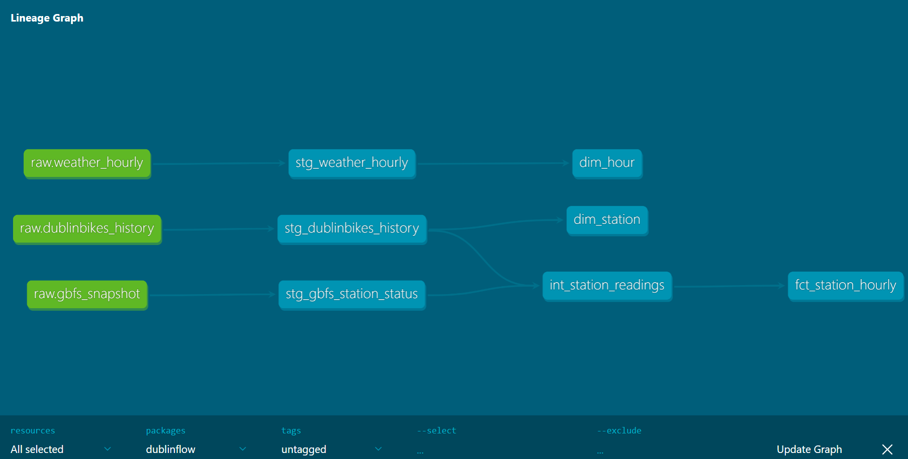

# DublinFlow: Dublin Bikes Reliability Data Platform

> Work in progress. Phases 1 to 6 of 9 done: live collection, raw data layer, 2 years of history and weather, and a tested dbt star schema.

## The question

How reliable is it to find a bike, or a free dock, at a Dublin Bikes station?
And how do weather, time of day and location change that?

## What this project does

An end-to-end data pipeline:

1. A Python collector reads the live Dublin Bikes feed every 10 minutes (GitHub Actions, triggered by cron-job.org) and saves the raw JSON to Azure Blob Storage.
2. Python loaders bring the raw files, 2 years of Smart Dublin station history and Met Éireann hourly weather into PostgreSQL.
3. dbt models clean, join and test the data (staging, intermediate, marts).
4. SQL analysis calculates a Reliability Score for each station.
5. A Power BI report presents the findings.

See [docs/architecture.md](docs/architecture.md) for the design and [docs/data_quality.md](docs/data_quality.md) for data checks and known gaps.

## Data model (dbt)



| Layer | Model | What it holds |
|---|---|---|
| Staging (views) | `stg_dublinbikes_history` | Smart Dublin history, typed, one row per station per snapshot |
| | `stg_gbfs_station_status` | Live feed JSON unpacked, one row per station per snapshot |
| | `stg_weather_hourly` | Met Éireann hourly weather, typed |
| Intermediate (view) | `int_station_readings` | History and live readings combined, with a `data_source` column |
| Marts (tables) | `fct_station_hourly` | Fact: one row per station per hour (bikes available, share of time empty, full, not renting) |
| | `dim_hour` | Every hour since May 2024 in UTC and Irish local time, with weather |
| | `dim_station` | One row per station: name, location, capacity |

Tests check uniqueness, missing values and the links from the fact table to both dimensions. A source freshness check warns if no live snapshot has arrived for 2 days.

## Reliability Score

`100 × (1 − share of time empty − share of time full)`, measured during service hours.
Empty % and full % are also reported separately.

## Tech stack

Python 3.12 · requests · psycopg · PostgreSQL · dbt Core · GitHub Actions · Azure Blob Storage · Power BI

## Repository structure

```
ingestion/          Python collector, downloaders and loaders
sql/                DDL and analysis queries
dbt/                dbt project (models and tests)
tests/              Python tests
powerbi/            Power BI report and screenshots
docs/               Architecture, data quality, data dictionary, findings
.github/workflows/  GitHub Actions schedules
```

## Getting started (Windows)

```
git clone https://github.com/rdsayanth/dublinflow.git
cd dublinflow
py -3.12 -m venv .venv
.\.venv\Scripts\Activate.ps1
python -m pip install -r requirements.txt
```

Copy `.env.example` to `.env` and fill in the values. Create the tables by running the files in `sql/raw/` against a `dublinflow` database, then:

```
python ingestion/load_raw_to_postgres.py        # live snapshots from Azure Blob
python ingestion/download_history.py            # Smart Dublin monthly CSVs
python ingestion/load_history_to_postgres.py
python ingestion/load_weather_to_postgres.py    # Met Éireann hourly weather
```

Then build and test the dbt models (run from the repo root; `dotenv run` loads `.env` so dbt finds the project and the database):

```
dotenv run -- dbt debug                 # check the connection
dotenv run -- dbt build                 # build all models and run all tests
dotenv run -- dbt source freshness      # check the live data is recent
dotenv run -- dbt docs generate         # build the documentation site
dotenv run -- dbt docs serve            # open it in the browser
```

## Data sources and attribution

- **Dublin Bikes live station feed (GBFS)**: station status and station information, collected every 10 minutes.
- **Smart Dublin**: historical Dublin Bikes station data, May 2024 to June 2026 ([dataset](https://data.smartdublin.ie/dataset/dublinbikes-api)).
- **Met Éireann**: hourly weather observations for Dublin Airport (station 532).
  Copyright Met Éireann. Source: [www.met.ie](https://www.met.ie). Licensed under [CC BY 4.0](https://creativecommons.org/licenses/by/4.0/) ([Met Éireann data licence](https://clidata.met.ie/cli/climate_data/showdata.php?action=data&file=Data_Licence.pdf)).
  This project aggregates the data by hour and joins it with bike availability.

## Author

Sayanth Rajani Divakaran · [GitHub](https://github.com/rdsayanth)