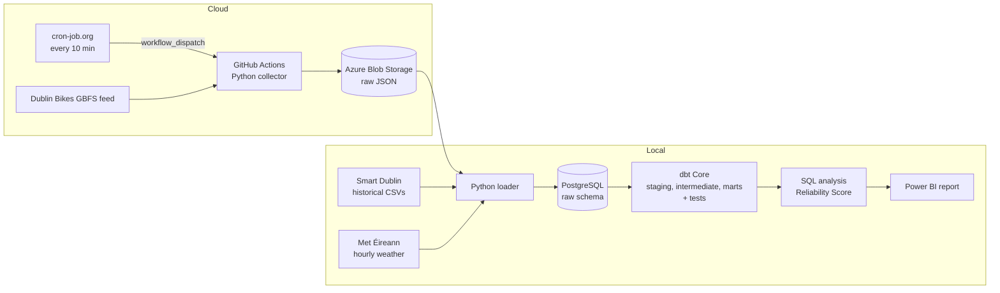

# DublinFlow architecture

## Overview

## Why this design

| Decision | Reason |
|---|---|
| Collector runs in GitHub Actions, not on my laptop | Data keeps collecting every 10 minutes even when the laptop is off. Free for public repos. |
| Runs are triggered by cron-job.org, with GitHub's own cron as a backup | GitHub's scheduled runs are best-effort and produced no runs in my first two hours. cron-job.org calls the GitHub API every 10 minutes using a token that can only run this repo's workflows. Both are free. |
| Raw JSON stored in Azure Blob Storage | Cheap, durable storage for raw files. Keeping the raw data means any later step can be re-run from scratch. |
| PostgreSQL runs locally | Free, and the data volume is small enough for one machine. |
| dbt for transformations | SQL models are version-controlled, tested and documented, with clear layers. |
| Power BI only at the end | The report reads from tested marts, so the numbers can be trusted. |

## Key data rules

- Snapshots show **availability, not trips**. Any "activity" measured from changes between snapshots is a proxy, because rebalancing vans also move bikes.
- Dublin Bikes timestamps are **UTC**. Met Éireann recent data is **Irish local time**. They are aligned carefully, including daylight saving changes.
- Weather comes from **one station** (Dublin Airport), so it is city-wide, not per bike station.
- The feed's own timestamps are used, not the time the collector ran, because GitHub Actions schedules can be delayed.

## Reliability Score

`100 × (1 − share of time empty − share of time full)`, during service hours.
Empty % and full % are also reported separately. No arbitrary weights.
